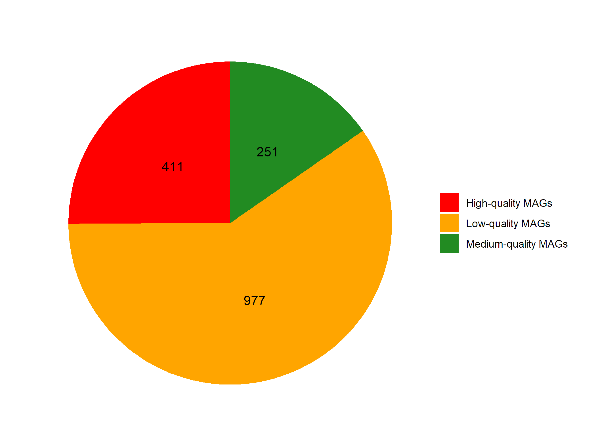

01_mags_quality
================
Compiled at 2025-06-19 02:18:17 UTC

``` r
here::i_am(paste0(params$name, ".Rmd"), uuid = "03a81c7d-53d8-457f-81a1-1d4a357b635d")
```

The purpose of this document is …

``` r
library("conflicted")
library(ggplot2)
```

    ## Warning: 程辑包'ggplot2'是用R版本4.3.3 来建造的

``` r
# create or *empty* the target directory, used to write this file's data: 
projthis::proj_create_dir_target(params$name, clean = F)

# function to get path to target directory: path_target("sample.csv")
path_target <- projthis::proj_path_target(params$name)

# function to get path to previous data: path_source("00-import", "sample.csv")
path_source <- projthis::proj_path_source(params$name)
```

## Tasks

The first task is …

## Files written

These files have been written to the target directory,
`data/01_mags_quality`:

``` r
projthis::proj_dir_info(path_target())
```

    ## # A tibble: 0 × 4
    ## # ℹ 4 variables: path <fs::path>, type <fct>, size <fs::bytes>,
    ## #   modification_time <dttm>

``` r
# 创建数据框
data <- data.frame(
  Category = c("Low-quality MAGs", "Medium-quality MAGs", "High-quality MAGs"),
  Count = c(977, 251, 411)
)

# 绘制饼图
ggplot(data, aes(x = "", y = Count, fill = Category)) +
  geom_bar(stat = "identity", width = 0.4) +
  coord_polar("y", start = 0) +
  geom_text(aes(label = Count), 
            position = position_stack(vjust = 0.5)) +
  labs(title = " ") +
  theme_void() +
  scale_fill_manual(values = c("red", "orange", "forestgreen")) +
  guides(fill = guide_legend(title = NULL))
```

<!-- -->
