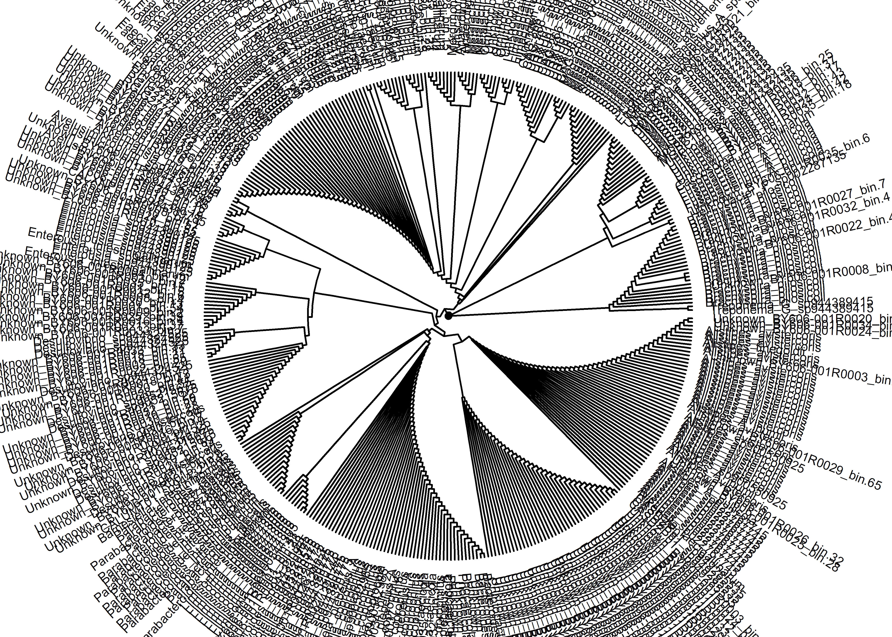

02_tree
================
Compiled at 2025-06-20 07:21:25 UTC

``` r
here::i_am(paste0(params$name, ".Rmd"), uuid = "5b24a080-2492-4222-9988-8db24c658c50")
```

The purpose of this document is …

``` r
library("conflicted")
library(tidyverse)
```

    ## Warning: 程辑包'ggplot2'是用R版本4.3.3 来建造的

    ## Warning: 程辑包'purrr'是用R版本4.3.3 来建造的

    ## Warning: 程辑包'stringr'是用R版本4.3.3 来建造的

    ## Warning: 程辑包'lubridate'是用R版本4.3.3 来建造的

    ## ── Attaching core tidyverse packages ──────────────────────── tidyverse 2.0.0 ──
    ## ✔ dplyr     1.1.4     ✔ readr     2.1.5
    ## ✔ forcats   1.0.0     ✔ stringr   1.5.1
    ## ✔ ggplot2   3.5.1     ✔ tibble    3.2.1
    ## ✔ lubridate 1.9.4     ✔ tidyr     1.3.1
    ## ✔ purrr     1.0.4

``` r
library(data.tree)
```

    ## Warning: 程辑包'data.tree'是用R版本4.3.3 来建造的

``` r
library(tidytree)
```

    ## Warning: 程辑包'tidytree'是用R版本4.3.3 来建造的

    ## If you use the ggtree package suite in published research, please cite
    ## the appropriate paper(s):
    ## 
    ## G Yu. Data Integration, Manipulation and Visualization of Phylogenetic
    ## Trees (1st ed.). Chapman and Hall/CRC. 2022. ISBN: 9781032233574
    ## 
    ## Guangchuang Yu.  Data Integration, Manipulation and Visualization of
    ## Phylogenetic Trees (1st edition). Chapman and Hall/CRC. 2022,
    ## doi:10.1201/9781003279242

``` r
library(ggtree)
```

    ## ggtree v3.10.1 For help: https://yulab-smu.top/treedata-book/
    ## 
    ## If you use the ggtree package suite in published research, please cite
    ## the appropriate paper(s):
    ## 
    ## Guangchuang Yu, David Smith, Huachen Zhu, Yi Guan, Tommy Tsan-Yuk Lam.
    ## ggtree: an R package for visualization and annotation of phylogenetic
    ## trees with their covariates and other associated data. Methods in
    ## Ecology and Evolution. 2017, 8(1):28-36. doi:10.1111/2041-210X.12628
    ## 
    ## Shuangbin Xu, Lin Li, Xiao Luo, Meijun Chen, Wenli Tang, Li Zhan, Zehan
    ## Dai, Tommy T. Lam, Yi Guan, Guangchuang Yu. Ggtree: A serialized data
    ## object for visualization of a phylogenetic tree and annotation data.
    ## iMeta 2022, 1(4):e56. doi:10.1002/imt2.56
    ## 
    ## Guangchuang Yu, Tommy Tsan-Yuk Lam, Huachen Zhu, Yi Guan. Two methods
    ## for mapping and visualizing associated data on phylogeny using ggtree.
    ## Molecular Biology and Evolution. 2018, 35(12):3041-3043.
    ## doi:10.1093/molbev/msy194

``` r
library(treeio)     
```

    ## treeio v1.26.0 For help: https://yulab-smu.top/treedata-book/
    ## 
    ## If you use the ggtree package suite in published research, please cite
    ## the appropriate paper(s):
    ## 
    ## LG Wang, TTY Lam, S Xu, Z Dai, L Zhou, T Feng, P Guo, CW Dunn, BR
    ## Jones, T Bradley, H Zhu, Y Guan, Y Jiang, G Yu. treeio: an R package
    ## for phylogenetic tree input and output with richly annotated and
    ## associated data. Molecular Biology and Evolution. 2020, 37(2):599-603.
    ## doi: 10.1093/molbev/msz240
    ## 
    ## Guangchuang Yu.  Data Integration, Manipulation and Visualization of
    ## Phylogenetic Trees (1st edition). Chapman and Hall/CRC. 2022,
    ## doi:10.1201/9781003279242
    ## 
    ## Guangchuang Yu, David Smith, Huachen Zhu, Yi Guan, Tommy Tsan-Yuk Lam.
    ## ggtree: an R package for visualization and annotation of phylogenetic
    ## trees with their covariates and other associated data. Methods in
    ## Ecology and Evolution. 2017, 8(1):28-36. doi:10.1111/2041-210X.12628

``` r
library(xml2)
library(glue)
```

``` r
# create or *empty* the target directory, used to write this file's data: 
projthis::proj_create_dir_target(params$name, clean = F)

# function to get path to target directory: path_target("sample.csv")
path_target <- projthis::proj_path_target(params$name)

# function to get path to previous data: path_source("00-import", "sample.csv")
path_source <- projthis::proj_path_source(params$name)
```

## Tasks

Convert the .tree file format to .nwk to facilitate phylogenetic tree
visualization on the iTOL platform.

## Files written

These files have been written to the target directory, `data/02_tree`:

``` r
projthis::proj_dir_info(path_target())
```

    ## # A tibble: 9 × 4
    ##   path                                 type         size modification_time  
    ##   <fs::path>                           <fct> <fs::bytes> <dttm>             
    ## 1 gtdbtk.bac120.summary.tsv            file      382.57K 2025-06-20 01:09:10
    ## 2 gtdbtk.backbone.bac120.classify.tree file      247.42K 2025-06-20 01:09:04
    ## 3 GTDB_tree_species.nwk                file       19.63K 2025-06-20 07:01:29
    ## 4 itol_annotation.R                    file        2.24K 2025-06-20 02:43:38
    ## 5 itol_phylum_colorstrip.txt           file       33.94K 2025-06-20 02:41:15
    ## 6 itol_phylum_treecolors.txt           file       21.87K 2025-06-20 02:41:15
    ## 7 phylo_tree_export.nwk                file       21.02K 2025-06-20 01:16:15
    ## 8 tree.svg                             file      714.97K 2025-06-20 07:18:14
    ## 9 tree_with_legend.svg                 file      740.08K 2025-06-20 07:20:08

``` r
# 2.1 读取 TSV（以制表符分隔）
tax <- read_tsv("data/02_tree/gtdbtk.bac120.summary.tsv", show_col_types = FALSE)
# 2.2 仅保留样本 ID 与分类列
tax <- tax %>% 
  select(user_genome, classification) %>% 
  mutate(across(everything(), str_trim))

# 2.3 将 classification 拆成 7 级 (d,p,c,o,f,g,s)
rank_names <- c("d", "p", "c", "o", "f", "g", "s")

tax <- tax %>% 
  separate(classification, into = rank_names, sep = ";", fill = "right", extra = "merge") %>% 
  mutate(across(all_of(rank_names), ~str_remove(.x, "^[a-z]__")))          # 去掉 d__ 前缀
# 3.1 生成 data.tree 格式的路径
tax <- tax %>% 
  rowwise() %>% 
  mutate(pathString = paste(c("Root", !!!syms(rank_names)), collapse = "/")) 

# # 3.2 转为 data.tree 对象
# tree_dt <- as.Node(tax, pathName = "pathString", pathDelimiter = "/")
# 
# # 3.3 将 data.tree 转为 phylo (ape) 对象，方便 ggtree 可视化
# phylo_obj <- as.phylo(tree_dt, collapse = FALSE)
```

``` r
tree <- read.tree("data/02_tree/gtdbtk.backbone.bac120.classify.tree")
# write.tree(tree_sub,
#            file = "data/02_tree/phylo_tree_export.nwk",
#            digits = 10,          # 保留小数位，可选
#            tree.names = TRUE)    # 若有多棵树可自动命名

# 可按需要剪枝，只保留本批 MAG
bins <- tax$user_genome
tree_sub <- ape::keep.tip(tree, bins)

tax_1 <- read_tsv("data/02_tree/gtdbtk.bac120.summary.tsv", show_col_types = FALSE)

## 3. 生成“叶节点 → 标签”映射
label_df <- tax_1 %>%
  mutate(
    # 提取 s__ 后面的物种名（若无则 NA）
    species_raw = str_extract(classification, "s__[^;]*$"),
    species_raw = str_remove(species_raw, "^s__")
  ) %>%
  mutate(
    # 若 species 为空/缺失，则用 user_genome
    label = ifelse(is.na(species_raw) | species_raw == "", user_genome, species_raw),
    # 清理任何特殊字符，保证 Newick 兼容
    label = str_replace_all(label, "[\\s\\(\\),:;]", "_")
  ) %>%
  select(user_genome, label)

## 4. 替换树的 tip.label
tree_sub$tip.label <- label_df$label[match(tree_sub$tip.label,
                                           label_df$user_genome)]

## 5. 导出 Newick
write.tree(tree_sub, file = "data/02_tree/GTDB_tree_species.nwk")

cat("✔ 已生成 Newick 文件：GTDB_tree_species.nwk\n")
```

    ## ✔ 已生成 Newick 文件：GTDB_tree_species.nwk

``` r
p <- ggtree(tree_sub, layout = "circular", branch.length = "none") +
     geom_tiplab(size = 2.5, hjust = -0.1) +     # 可自行调节 size/hjust
     geom_rootpoint()
p
```

<!-- -->

``` r
#---------------------------------------------------------------------
# 0. 准备 phylum–color 数据框
phylum_tbl <- tribble(
  ~phylum,            ~color,
  "Bacillota_C",      "#9EC9CE",
  "Bacteroidota",     "#B2E20D",
  "Deferribacterota", "#C20BA9",
  "Bacillota_I",      "#31E475",
  "Bacillota_A",      "#2A74E4",
  "Desulfobacterota", "#F3740D",
  "Spirochaetota",    "#759298",
  "Bacillota",        "#59E65A",
  "Fusobacteriota",   "#FF0AC4",
  "Campylobacterota", "#F2F45A",
  "Pseudomonadota",   "#B8B15B",
  "Elusimicrobiota",  "#F8FE88",
  "Verrucomicrobiota","#DCB562",
  "Actinomycetota",   "#479819",
  "Cyanobacteriota",  "#0625A9"
)

#---------------------------------------------------------------------
# 1. 读取 SVG
svg_doc  <- read_xml("data/02_tree/tree.svg")
root     <- xml_root(svg_doc)

#---------------------------------------------------------------------
# 2. 获取坐标系尺寸  -----------------------------------------------
# 若 <svg> 有显式 width/height，用它们；否则解析 viewBox
get_px <- function(x) as.numeric(str_remove(x, "px$"))
w <- if (!is.na(xml_attr(root, "width")))  get_px(xml_attr(root, "width"))  else NA_real_
h <- if (!is.na(xml_attr(root, "height"))) get_px(xml_attr(root, "height")) else NA_real_

if (is.na(w) || is.na(h)) {                       # fallback: viewBox="0 0 w h"
  vb <- str_split(xml_attr(root, "viewBox"), "\\s+")[[1]]
  w  <- as.numeric(vb[3]);  h <- as.numeric(vb[4])
}

#---------------------------------------------------------------------
# -------------------------------------------------------------
# 图例排版参数（更新）
box_size <- 30            # ⬆︎ 色块边长，原 14 → 20
pad      <- 8             # ⬆︎ 色块‑文字间距
line_gap <- 6             # ⬆︎ 行距
font_sz  <- 30            # ⬆︎ 字号

legend_margin <- 200       # 与 SVG 右边界保留的像素空隙
legend_y      <- h * 0.25 # 顶端起始 y

# -------------------------------------------------------------
# 重新计算 legend_x：使图例整体“贴右”
max_chars   <- max(nchar(phylum_tbl$phylum))
char_width  <- font_sz * 0.6                # 粗略字体宽度系数
legend_w    <- box_size + pad + max_chars * char_width
legend_x    <- w - legend_w - legend_margin

#---------------------------------------------------------------------
# 4. 构造 <g id="legend"> 并逐行添加 rect + text ---------------------
legend_grp <- xml_add_child(root, "g", id = "legend")

# 图例组
legend_grp <- xml_add_child(root, "g", id = "legend")

# ---- 图例标题：Phylum ----
xml_add_child(
  legend_grp, "text",
  x = legend_x,
  y = legend_y - (box_size + line_gap),  
  fill = "black",
  `font-size` = font_sz + 2,
  `font-weight` = "bold",
  `font-family` = "sans-serif"
) %>% xml_set_text("Phylum")
```

    ## {xml_node}
    ## <text x="2000" y="284.6666875" fill="black" font-size="32" font-weight="bold" font-family="sans-serif">

``` r
for (i in seq_len(nrow(phylum_tbl))) {
  y0 <- legend_y + (i - 1) * (box_size + line_gap)

  # 色块
  xml_add_child(
    legend_grp, "rect",
    x = legend_x, y = y0,
    width = box_size, height = box_size,
    fill = phylum_tbl$color[i], stroke = "none"
  )

  # 标签文字
  xml_add_child(
    legend_grp, "text",
    x = legend_x + box_size + pad,
    y = y0 + box_size * 0.75,                    # 基线微调
    fill = "black",
    `font-size` = font_sz,
    `font-family` = "sans-serif"
  ) %>% xml_set_text(phylum_tbl$phylum[i])
}

#---------------------------------------------------------------------
# 5. 写出新 SVG ------------------------------------------------------
write_xml(svg_doc, "data/02_tree/tree_with_legend.svg")
```
